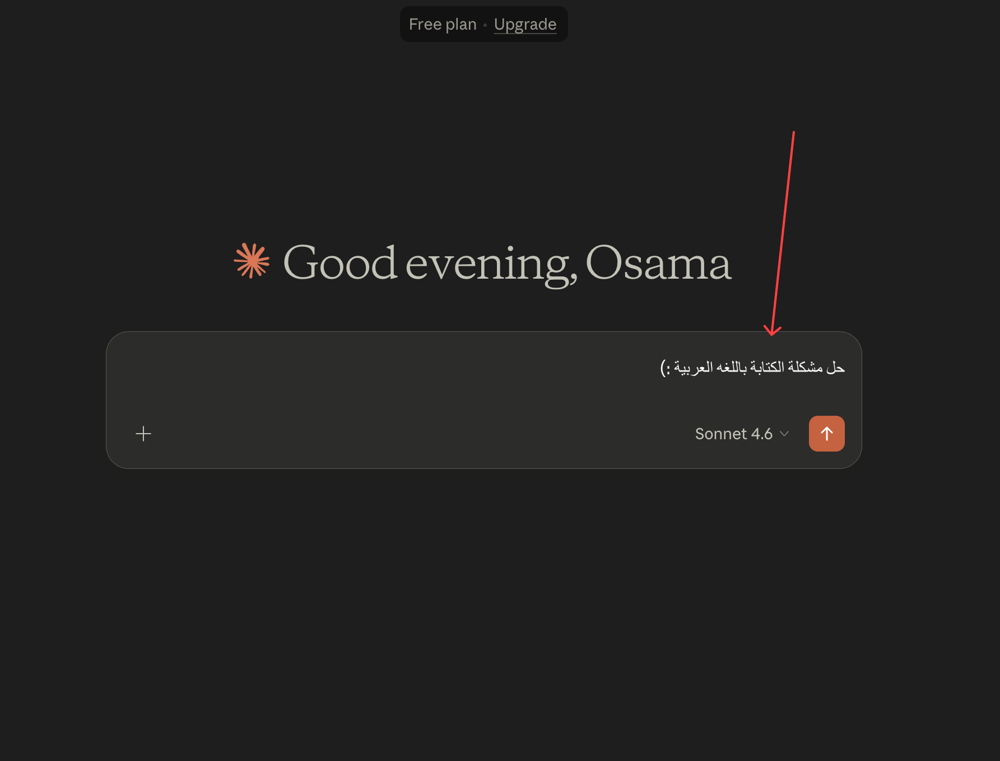
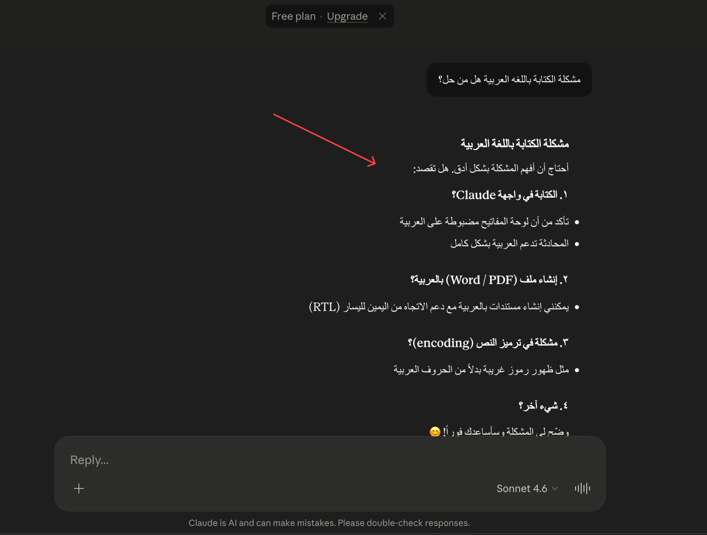

<p align="center">
  
</p>

<h1 align="center">AutoRTL</h1>

<p align="center">
  <strong>Automatically fix Arabic &amp; RTL text direction across all websites.</strong><br />
  A browser extension (Manifest V3) for Chrome and Firefox that detects Arabic text and switches inputs, textareas, contenteditable elements, and displayed content to RTL — instantly.
</p>

<p align="center">
  <a href="LICENSE"></a>
  
  
  
</p>

---

## Screenshots

<p align="center">
  
</p>
<p align="center"><em>Arabic input automatically switches to RTL direction</em></p>

<p align="center">
  
</p>
<p align="center"><em>Output text also fixed — headings, paragraphs, and lists render RTL</em></p>

---

## Features

- **Auto-detect Arabic** — regex-based detection for Arabic, Persian, and Urdu scripts
- **Fix inputs & outputs** — works on `<input>`, `<textarea>`, `[contenteditable]`, paragraphs, headings, lists, and more
- **MutationObserver** — handles dynamically loaded content (React, chat apps, SPAs)
- **Smart behavior** — only changes direction after typing; never touches empty fields
- **Mixed text support** — `unicode-bidi: plaintext` ensures Arabic + English renders correctly
- **Custom Arabic fonts** — choose from 10 popular Google Arabic fonts (Cairo, Amiri, Tajawal, etc.)
- **3 modes** — Auto (default), Force RTL, Force LTR
- **Site exclusion list** — exclude specific sites with one click, manage and restore anytime
- **Premium popup** — toggle, mode selector, font chips with live preview, live stats
- **Persistent settings** — saved via `chrome.storage.local`
- **Cross-browser** — works on both Chrome and Firefox (Manifest V3)
- **Works everywhere** — ChatGPT, Claude, WhatsApp Web, Google Docs, and all websites

## Installation

### Chrome — From source (Developer Mode)

1. Clone this repository:
   ```bash
   git clone https://github.com/OAbouHajar/AutoRTL.git
   ```
2. Open Chrome and navigate to `chrome://extensions`
3. Enable **Developer Mode** (top-right toggle)
4. Click **Load unpacked**
5. Select the cloned `AutoRTL` folder
6. Done! The extension icon appears in the toolbar

### Firefox — From source (Temporary)

1. Clone this repository
2. Open Firefox and navigate to `about:debugging#/runtime/this-firefox`
3. Click **Load Temporary Add-on...**
4. Select the `manifest.json` file from the cloned folder
5. Done! The extension icon appears in the toolbar

### From Chrome Web Store

> Coming soon.

### From Firefox Add-ons (AMO)

> Coming soon.

## Usage

1. **Navigate** to any website with Arabic text
2. **Type Arabic** in any input field — direction switches to RTL automatically
3. **Displayed text** containing Arabic is also fixed on page load
4. Click the **extension icon** in the toolbar to open settings:
   - Enable/disable the extension
   - Choose direction mode (Auto / RTL / LTR)
   - Select a custom Arabic font
   - View live stats
5. **Exclude a site** — click the 🚫 Exclude button to skip the current website
6. **Manage exclusions** — view all excluded sites, restore individually or all at once

## Project Structure

```
AutoRTL/
├── manifest.json       # Extension manifest (v3) — Chrome + Firefox (Gecko)
├── content.js          # Core logic (direction detection, DOM scanning, MutationObserver, site exclusion)
├── style.css           # Injected page styles
├── popup.html          # Settings popup UI
├── popup.css           # Premium popup styles
├── popup.js            # Popup logic & settings management
├── icons/
│   ├── icon16.png
│   ├── icon48.png
│   └── icon128.png
├── imgs/
│   ├── img1.png
│   └── img2.png
├── LICENSE             # MIT License
├── README.md
├── CONTRIBUTING.md
└── .gitignore
```

## Supported Fonts

| Font | Style |
|------|-------|
| Noto Naskh Arabic | Serif (Naskh) |
| Amiri | Serif (Naskh) |
| Cairo | Sans-serif |
| Tajawal | Sans-serif |
| IBM Plex Sans Arabic | Sans-serif |
| Readex Pro | Sans-serif |
| Noto Kufi Arabic | Sans-serif (Kufi) |
| Almarai | Sans-serif |
| Scheherazade New | Serif (Naskh) |
| Lateef | Serif (Nastaliq) |

Fonts are loaded on-demand from Google Fonts only when selected.

## Contributing

Contributions are welcome! Please read [CONTRIBUTING.md](CONTRIBUTING.md) for guidelines.

## Author

**OAbouHajar**

- GitHub: [@OAbouHajar](https://github.com/OAbouHajar)
- Facebook: [oabouhajar](https://www.facebook.com/oabouhajar/)

## License

This project is licensed under the [MIT License](LICENSE).
